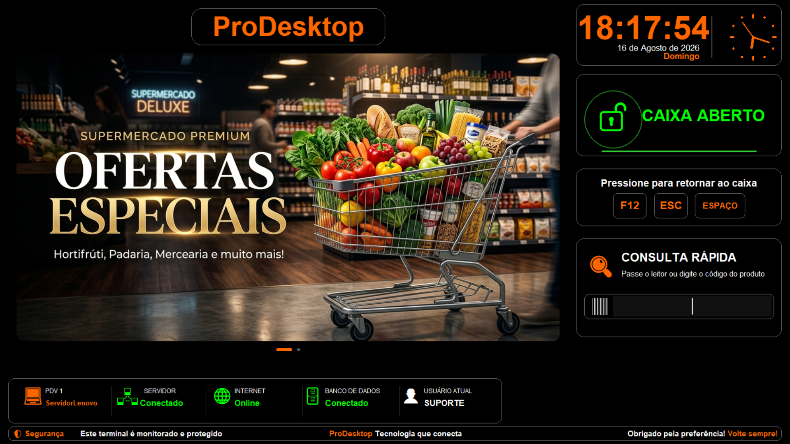
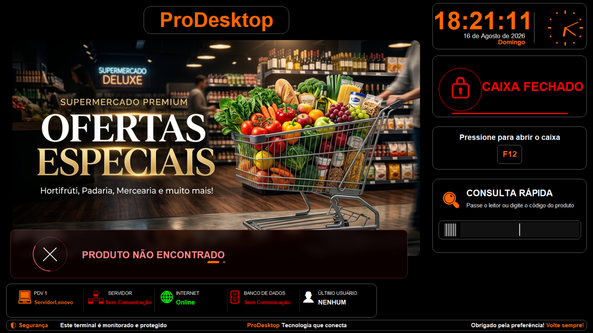
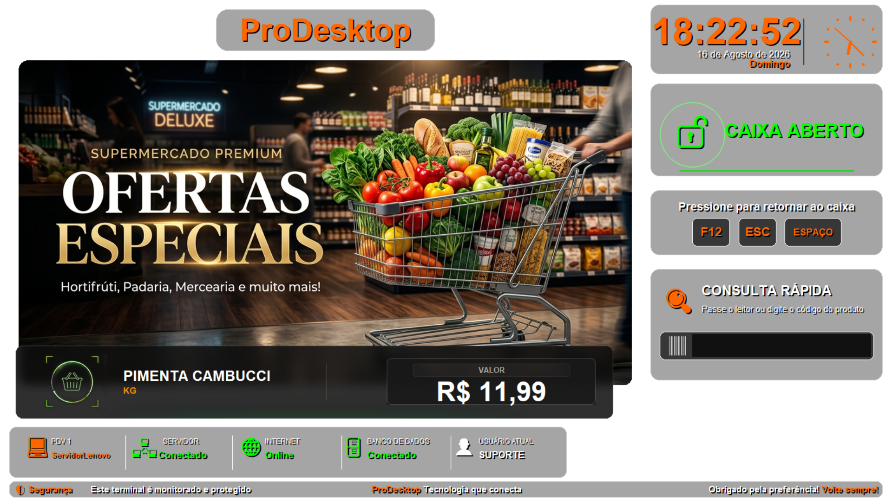

# 🛒 ProDesktop - PDV Interactive & Marketing Screen

O **ProDesktop** é uma solução avançada em Python projetada para maximizar o engajamento no Frente de Caixa (PDV) e atuar como um *idle screensaver* inteligente. Em momentos de inatividade, o sistema assume o controle do terminal, convertendo a tela estática em um **painel dinâmico de publicidade e autoatendimento**.

Desenvolvido com arquitetura cliente-servidor leve, ele emprega uma interface premium orientada a eventos (Tkinter customizado com overlays translúcidos via PIL) e monitora de forma autônoma o status da rede e do SGBD subjacente.

---

## 📸 Telas do Sistema (Demonstração)

Abaixo estão capturas de tela do sistema em execução, detalhando os modos de repouso, notificação de status e overlay de consulta:








---

## ✨ Arquitetura & Features

* **Renderização Dinâmica de Assets:** Loop de carrossel de encartes implementado com carregamento sob demanda para otimizar alocação de memória RAM em hardwares de PDV limitados.
* **Consulta de Preços (Barcodes & RFID):** Integração via driver assíncrono para captura de input do leitor. O sistema realiza *queries* diretas no SGBD (Firebird) para recuperar preço, fator de conversão de unidade, e lógicas complexas de promoção (Leve X Pague Y, Atacado, etc).
* **Network & Health Monitoring:** Thread dedicada executando *heartbeats* e *socket connections* para avaliar a latência e status do Servidor Principal, Internet e integridade da conexão DB.
* **Smart UI / Overlay System:** O card de consulta utiliza técnicas de renderização vetorial on-the-fly para gerar overlays com vidro fosco (glassmorphism), garantindo contraste com qualquer encarte rodando no fundo. O tamanho de fontes é calculado dinamicamente baseando-se no payload retornado no banco de dados.
* **Self-Deployment ("Vírus do Bem"):** Rotina automatizada que verifica o path de execução (`sys.executable`) e, caso necessário, clona a si mesmo para o diretório oficial de sistema, injetando *shortcuts* no Windows Startup (via script VBScript embeddado).

---

## ⚙️ Processo de Configuração e Instalação

O projeto foi empacotado para ser modular. O arquivo `.exe` depende do arquivo `.ini` para injetar variáveis de ambiente locais, mantendo o binário agnóstico.

### 1. Dependências Core
* SO Windows.
* Driver nativo do Firebird (`fbclient.dll`) no path relativo da aplicação ou no System32.

### 2. Inicialização e Auto-Setup
Inicie o executável `ProDesktop_Descanso.exe`. Se um ambiente não estiver configurado, ele gerará automaticamente um arquivo de manifesto de configuração (`config.ini`) aplicando padrões de fallback.

### 3. Configuração do Ambiente (`config.ini`)
Ajuste os parâmetros locais para rotear a conexão adequadamente. O arquivo `config.ini` adota o padrão abaixo:

```ini
[REDE]
ip = 192.168.0.100

[SISTEMA]
pdv = 1
loja = SUPERMERCADO MATRIZ
imagem_fundo = fundo_moderno.png
caminho_pdv = C:\Caminho\PDV.exe
ativar_repouso = 10
caminho_banco = C:\Base\Banco.IB
senha_banco = ****  ; Informe a senha real apenas no seu ambiente local
codigo_filial = 1
exibir_promocoes = S
exibir_imagens_promocoes = S
```

> **Security Note:** A stack suporta chaves de acesso externas. A variável `senha_banco` não deve nunca ser persistida ou *hardcoded* no código fonte; ela deve constar apenas no arquivo INI isolado do controle de versão.

### 4. Deploy de Mídia
Os assets de marketing devem ser armazenados em `./encartes/`. A aplicação possui um *watcher* simplificado que recarrega a fila de imagens periodicamente para a transição dos frames.

### 5. Build System
Para compilar a partir do código fonte com o PyInstaller injetando todos os recursos estáticos, utilize o *batch script* `compilar.bat`. Ele aplicará as flags `--onefile`, `--windowed` e `--add-data` para os assets nativos.

---

*ProDesktop — Redefinindo a interatividade no PDV.*
